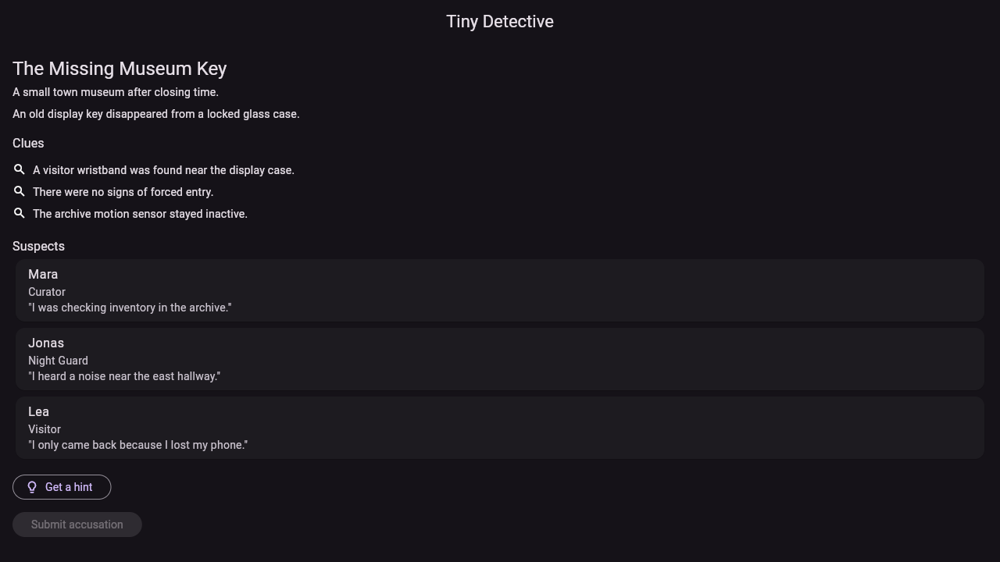
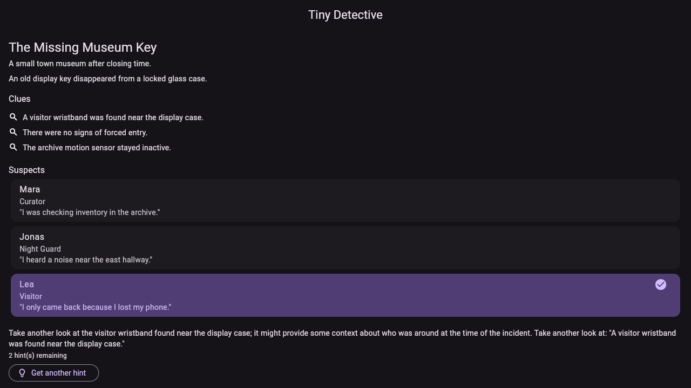
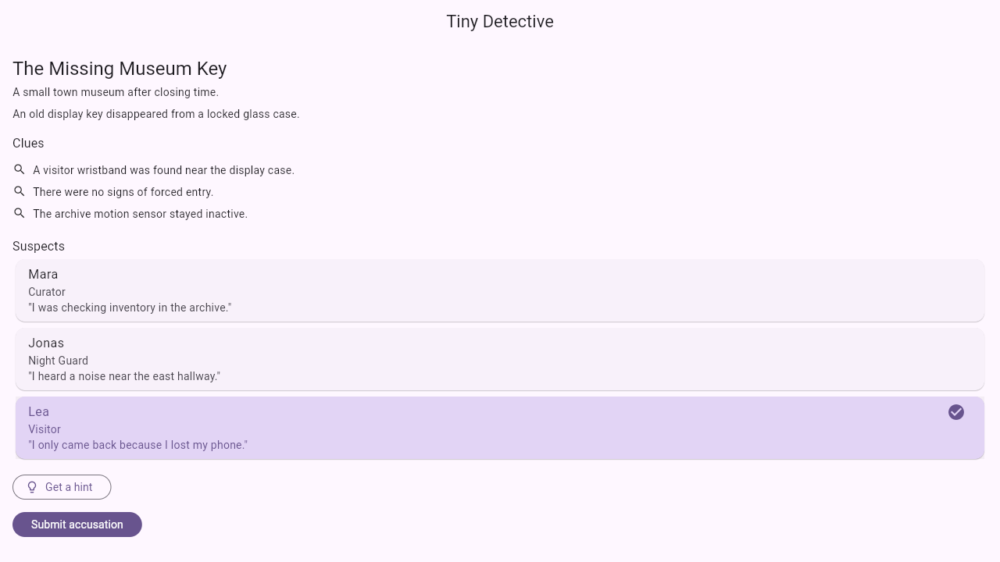
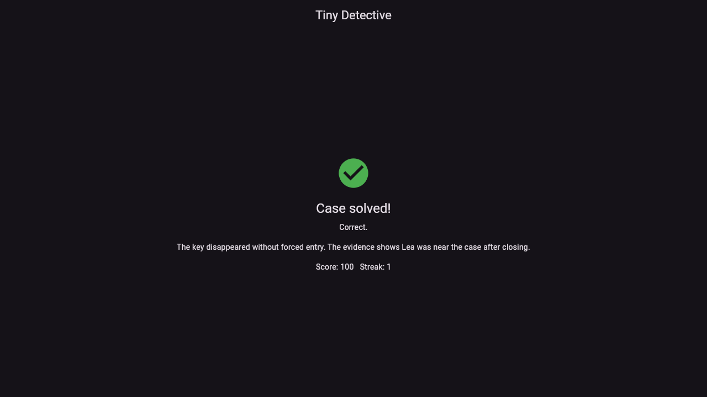

# Tiny Detective AI

A casual detective game where players read a short mystery, inspect suspects and clues, optionally ask for limited AI hints, submit their solution, and can generate a brand-new AI case live to keep playing. Built as a compact but serious full-stack product prototype: Flutter frontend, FastAPI backend, Firestore persistence, and an AI-native content/evaluation pipeline for generating and vetting cases.

**Live demo:** [tiny-detective-ai.web.app](https://tiny-detective-ai.web.app) — real Cloud Run backend, real Firestore, real OpenAI-backed hints and case generation. Note: both the hint endpoint and the "Generate a new case" feature are rate-limited (see Deployment Overview below); if a daily case isn't published, the app shows its error state with a retry button.

|                                                                              |                                                                                |
| ---------------------------------------------------------------------------- | ------------------------------------------------------------------------------ |
|  |  |
|  |  |

Captured live against the deployed app above, not a local build.

## Tech Stack

- **Frontend:** Flutter (web target), clean layered architecture per feature
- **Backend:** FastAPI, Pydantic, clean domain/application/infrastructure layering
- **Persistence:** Firestore
- **AI:** OpenAI API, backend/tooling-only (never called directly from the Flutter app) — case generation, multi-stage evaluation, and a grounded, guardrailed in-game hint assistant
- **CI/CD:** GitHub Actions — CI (5 jobs: frontend, backend, contract, AI-tool, Docker build) + Deploy (Cloud Run + Firebase Hosting, gated on CI passing)
- **Deployment:** Firebase Hosting (frontend), Cloud Run (backend), both live

## Architecture

See [`docs/architecture.md`](docs/architecture.md) for the full breakdown (app/service/tool separation, layering, API flow, AI pipeline, deployment topology). Architectural decisions are recorded in [`docs/architecture-decisions/`](docs/architecture-decisions/).

```text
apps/game/       Flutter app
services/api/    FastAPI backend
tools/ai-content/  AI case generation & evaluation tooling
packages/        shared contracts / rules
docs/            architecture docs and ADRs
```

## Local Setup

### Frontend (`apps/game`)

```bash
cd apps/game
flutter pub get
flutter analyze
flutter test
flutter run -d chrome
flutter build web --release
```

The app talks to the backend at `http://localhost:8000` by default (override with `--dart-define=API_BASE_URL=...`). Start the backend first (see below) and publish a daily case, or the app will show its error state with a retry button.

### Backend (`services/api`)

This project uses [uv](https://docs.astral.sh/uv/) instead of pip+venv for the backend.

```bash
cd services/api
uv sync
uv run uvicorn app.main:app --reload
uv run pytest
```

Repositories are Firestore-backed when `FIRESTORE_EMULATOR_HOST`/`GOOGLE_CLOUD_PROJECT` is set, in-memory otherwise (two seeded demo cases: `case_museum_001` approved, `case_bakesale_001` draft) — unset is safe, not an error. Admin routes (`/admin/cases/...`) require an `X-Admin-Token` header matching the `ADMIN_API_TOKEN` environment variable; unset by default, which disables them entirely. The hint endpoint (`POST /cases/{id}/hint`) calls OpenAI for a grounded, guardrailed hint if `OPENAI_API_KEY` is set — unset is safe too, it just always returns the deterministic fallback hint.

Set these via a local `.env` file (loaded automatically, gitignored) instead of exporting them every time:

```bash
cp .env.example .env   # then fill in ADMIN_API_TOKEN / OPENAI_API_KEY / FIRESTORE_EMULATOR_HOST
uv run uvicorn app.main:app --reload
```

Or inline for one-off runs:

```bash
ADMIN_API_TOKEN=devsecret uv run uvicorn app.main:app --reload
curl -X POST -H "X-Admin-Token: devsecret" localhost:8000/admin/cases/case_museum_001/publish-daily
curl localhost:8000/cases/daily
```

**Firestore emulator** (optional — without it, the app runs fine on in-memory repositories):

```bash
docker run -d --name tiny-detective-firestore-emulator -p 8080:8080 \
  gcr.io/google.com/cloudsdktool/cloud-sdk:emulators \
  gcloud emulators firestore start --host-port=0.0.0.0:8080

echo "FIRESTORE_EMULATOR_HOST=localhost:8080" >> .env
uv run uvicorn app.main:app --reload   # now Firestore-backed; seeds the two demo cases on first run
uv run pytest                          # unaffected either way — see below
```

Demo-case seeding (`app/api/dependencies.py`'s `_should_seed_demo_cases`) is gated specifically on `FIRESTORE_EMULATOR_HOST` being set, not just "Firestore is configured" — in production, `GOOGLE_CLOUD_PROJECT` is set but `FIRESTORE_EMULATOR_HOST` is not (see [ADR-0006](docs/architecture-decisions/ADR-0006-deployment-topology.md)), so a freshly-provisioned or accidentally-wiped production database is never silently auto-populated with demo content — it stays empty until an admin deliberately publishes real content.

`uv run pytest` **always** uses in-memory repositories and never touches Firestore, real or emulated, regardless of `.env` — dependency wiring detects it's running under pytest and forces the in-memory fallback. Real-Firestore tests live in `tests/integration/` and construct their own repository instances directly with an explicit client, skipping the whole module if the emulator isn't reachable.

### AI Content Tools (`tools/ai-content`)

Its own `uv` project — the OpenAI SDK lives here, not in the backend.

```bash
cd tools/ai-content
uv sync
cp .env.example .env                # then fill in OPENAI_API_KEY (loaded automatically, gitignored)
uv run generate_cases.py --count 3  # generate + evaluate + store as local drafts
uv run pytest                       # automated tests — no API key needed (fake evaluators)
```

See [`tools/ai-content/README.md`](tools/ai-content/README.md) and [`docs/ai-workflow.md`](docs/ai-workflow.md).

## Test Commands

```bash
# Frontend
cd apps/game && flutter test

# Backend
cd services/api && uv run pytest

# AI content tools
cd tools/ai-content && uv run pytest
```

## AI Workflow Summary

AI is part of the product architecture in three places: case generation, case evaluation, and a constrained in-game hint assistant. AI calls only ever happen server-side or in offline tooling — never from the Flutter app. Case generation and two of the five evaluation stages (logic consistency, safety) call the OpenAI API from `tools/ai-content`; schema validation, rule-based validation, and difficulty assignment are deterministic Python, no API call. The hint assistant calls OpenAI live from `services/api` (a player-facing request, not an offline batch job — see [ADR-0004](docs/architecture-decisions/ADR-0004-hint-assistant-guardrails.md)), sees only public case data, must ground every hint in a real existing clue, and falls back to a deterministic hint on any failure or guardrail violation. Details: [`docs/ai-workflow.md`](docs/ai-workflow.md).

## Deployment Overview

Live: Firebase Hosting for the Flutter web build, Cloud Run for the FastAPI backend (Workload Identity Federation, no stored deploy key), real Firestore, GitHub Actions for CI/CD (`ci.yml` gates `deploy.yml` via `workflow_run`). The public, OpenAI-backed `/hint` endpoint is rate-limited per IP, Cloud Run is capped at 3 instances, and a small budget alert exists as a backstop. Full detail and the reasoning behind each choice: [`docs/deployment.md`](docs/deployment.md), [ADR-0006](docs/architecture-decisions/ADR-0006-deployment-topology.md).

## Main Trade-offs

- **uv over pip+venv** for the backend — faster, but a second tool to know beyond what the project spec documents as the default.
- **Clean/layered architecture** for both app and backend, even at MVP scale — more files and indirection, chosen because the project's explicit goal is to demonstrate architectural discipline (see [ADR-0002](docs/architecture-decisions/ADR-0002-clean-architecture.md)).
- **Phase 1 scaffolds only the top-level `apps/`/`services/`/`tools/`/`packages/` separation**, not the full per-feature directory tree from the project spec's "Recommended Monorepo Structure" — those get created feature-by-feature as Phases 2–7 land, to avoid empty directories with no real content.
- **In-memory repositories were the Phase 3 default; Firestore (Phase 7) is now the real backing when configured** — same `CaseRepository`/`PlayerRepository`/`HintRequestRepository`/`AttemptRepository` interfaces (`app/application/ports.py`) either way, swapped in `app/api/dependencies.py` based on environment, zero use-case or route changes needed for the swap (see [ADR-0005](docs/architecture-decisions/ADR-0005-firestore-data-model.md)). No real GCP project was available in this environment — the local Firestore emulator (Docker) stands in.
- **Admin auth is a single shared-secret header** (`X-Admin-Token` / `ADMIN_API_TOKEN`), not real authentication — adequate for an MVP admin surface with no real users yet; would need replacing before any real admin access is exposed.
- **One `CaseRepository` covers case-fetch, solution-submit and hint-request** on the frontend, rather than splitting hints into their own repository — the whole gameplay loop is one cohesive use case from the UI's perspective; matches how `suspects`/`clues` stay presentation-and-domain-only (no independent data layer) since neither has its own endpoint.
- **No local state persistence in the Flutter app yet** — a new anonymous player is created every time the app boots (`POST /players`). Fine for demoing the loop; a real "resume as the same player" experience needs local storage, not yet built.
- **Flutter's CanvasKit renderer draws to `<canvas>`**, not DOM text nodes — standard browser-automation text locators (Playwright's `getByText`, etc.) don't see anything. Verification of this phase used screenshots and coordinate-based clicks instead; worth knowing before assuming a text-locator-based e2e suite would "just work" against this app.
- **Only Logic Consistency and Safety evaluation call the AI provider** — Schema, Rule-Based, and Difficulty stages are deterministic Python. Keeps the automated test suite free, fast, and runnable without an API key (see [ADR-0003](docs/architecture-decisions/ADR-0003-ai-content-pipeline.md)); a separate manual script (`evaluate_cases.py`) exists specifically to spend real API calls checking the AI judges' actual quality.
- **`tools/ai-content` and `services/api` each depend on the OpenAI SDK independently**, with separate `.env` files — the offline generation pipeline and the live hint assistant are different runtime contexts (batch/admin-triggered vs. inside a player's real-time request), so this isn't shared even though it's some duplication (see [ADR-0004](docs/architecture-decisions/ADR-0004-hint-assistant-guardrails.md)). The live case-generation feature (ADR-0007) is the one exception: `services/api` depends on `tools/ai-content` directly as a `uv` editable path dependency and reuses its generator/evaluator code as-is, deliberately choosing that coupling over duplicating hundreds of lines of real validation logic.
- **Live case generation (`POST /cases/generate`) is a scoped, documented exception to "no unvetted AI case reaches players"** — opt-in, still gated by both real AI judges plus a domain consistency check, capped by a global daily budget (a success cap the player sees, and a separate, higher attempt cap that also counts judge-rejected attempts, since those cost tokens too and aren't otherwise bounded), and every result is tagged `source="live_generated"` so it stays distinguishable from curated content. Real per-attempt cost (post-redesign, gpt-4o-mini): ~$0.0007-0.0015. See [ADR-0007](docs/architecture-decisions/ADR-0007-live-case-generation.md).
- **The initial ~29% retry-count estimate for live case generation was small-sample noise — the real production rate was closer to 5-10%,** found live (players hitting "could not generate a valid case" often enough to report it), root-caused by reading real rejected candidates directly (solutions "matching" a clue property the clue itself never actually stated). Two rounds of prompt engineering, and a controlled test swapping the generator model to gpt-4o, all failed to move that number — a real, reported negative result, and evidence the problem was task design, not model capability. **Fixed with a redesign, not a bigger retry budget: a deterministic Python constraint solver now decides who's guilty and verifies solvability before any LLM call; the LLM only writes prose around that already-correct structure** (`tools/ai-content/ai_content/logic_builder.py`, `CaseProseRenderer`). Real measured pass rate after the redesign: **32.5%** (13/40 across two real 20-call batches) — ~6.5x the old rate, at unchanged per-attempt cost, letting `MAX_ATTEMPTS_PER_REQUEST` drop from 10 back to 5. See [ADR-0007](docs/architecture-decisions/ADR-0007-live-case-generation.md)'s redesign addendum.
- **Draft storage (`tools/ai-content`) is still local JSON files**, not Firestore — `import_cases.py`/`publish_case.py` (bridging a draft into the backend's `cases/{caseId}` collection) still aren't built. Phase 7 gave the backend a real persistent repository to import into, but building that bridge specifically wasn't part of what was asked for this phase.
- **The hint guardrail scans only the AI-generated commentary, and checks names unconditionally but roles only when they're not grounded in the specific clue being referenced** — a role is exactly as identifying as a name (this project's roles are unique per case), but a clue can legitimately share a word with a role (e.g. "a visitor wristband") without that being an accusation. A names-only guardrail was tried first and reopened a real gap; a role-or-name guardrail with no grounding exception false-positived on legitimate hints. See [ADR-0004](docs/architecture-decisions/ADR-0004-hint-assistant-guardrails.md)'s addendum for the full back-and-forth.
- **Tests can't accidentally call real external services** — `get_openai_client()` (both `services/api` and `tools/ai-content`) raises, and Firestore dependency wiring silently falls back to in-memory, whenever `"pytest" in sys.modules` — checked that way rather than the more common `PYTEST_CURRENT_TEST`, because the latter is only set during individual test execution, not during pytest's collection phase. That gap was found by deliberately stopping the emulator mid-development and re-running the suite: it hung for ~45 seconds instead of failing fast. See [ADR-0005](docs/architecture-decisions/ADR-0005-firestore-data-model.md)'s addendum.
- **All repository/AI-client providers in `app/api/dependencies.py` are `@lru_cache`d, not built at module-import time** — a network client (Firestore, OpenAI) is only ever constructed the first time a route actually resolves that dependency, not merely by importing the module. This started as an eager module-level singleton; changed after review flagged that shape as the actual root cause behind the pytest-hang bug above, not just something the guard needed to survive. See [ADR-0005](docs/architecture-decisions/ADR-0005-firestore-data-model.md)'s second addendum.
- **Emulator-only verification held through Phase 7; Phase 8's real deploy closed part of that gap** — today's query shapes now confirmed against real Firestore (no missing-index errors), but `firestore.rules` enforcement itself is still unexercised since the backend's server SDK bypasses Security Rules via IAM entirely. See [`docs/scalability.md`](docs/scalability.md).
- **Workload Identity Federation for Cloud Run, a stored service-account key for Firebase Hosting** — not one blanket "no keys" principle, an honest trade-off between two ecosystems' idiomatic deploy-auth paths. See [ADR-0006](docs/architecture-decisions/ADR-0006-deployment-topology.md).
- **One `deploy.yml` with two `needs:`-ordered jobs, not three separate `workflow_run`-chained workflow files** — the project spec's monorepo listing names `deploy-web.yml`/`deploy-api.yml` separately; simplified after review since a 3-deep trigger chain is harder to debug and a broken link is easy to miss in the Actions UI, for no real benefit at this project's size. See [ADR-0006](docs/architecture-decisions/ADR-0006-deployment-topology.md).
- **`contract-checks` in CI deliberately re-runs a subset of what `backend-checks` already covers** — the project spec names it as its own job, and a separately-labeled failure states what broke more precisely than a generic backend-checks failure would, for a small, accepted amount of duplicated CI time.

## Project Status

All 8 phases complete. `docs/phase-reviews.md` (local, not published — see `.gitignore`) has the full phase-by-phase review history; [`docs/final-review.md`](docs/final-review.md) has the closing architecture and quality review.
